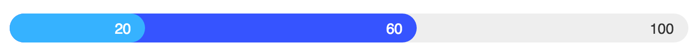

# Overlap Bar

A ReactJS component for a stacked fillable gauge where each bar is overlapped to
the others.



## Installation

Install with `npm install overlap-bar` and `import` in your project.

## Usage

This component accepts the following properties:

- `data` (**mandatory**): the data used to draw the gauges. It can either be an
array of numbers or an array of objects (see the examples below);
- `max`: the full scale used to draw the gauges. Defaults to the highest value
passed in the `data` property, but can be manually set;
- `showLabels`: a boolean value that controls the visibility of the labels
within the gauges. Defaults to `false`;
- `formatLabel`: a function that returns the rendered label. Use this to change
how your label appears within the gauge. Defaults to `(value) => value`

### Examples

To draw a simple gauge just pass an array of numbers:

```javascript
import React from 'react'
import OverlapBar from 'overlap-bar'

class MyComponent extends React.Component {
    render() {
        let data = [10, 40, 100]

        return (
            <OverlapBar data={data} />
        )
    }
}

export default MyComponent
```

To draw a gauge with custom colors you can pass data like in this example:

```javascript
import React from 'react'
import OverlapBar from 'overlap-bar'

class MyComponent extends React.Component {
    render() {
        let data = [{
            value: 30,
            backgroundColor: '#ff0000'
        }, {
            value: 80,
            backgroundColor: '#00ff00'
        }]

        return (
            <OverlapBar data={data} max={100} />
        )
    }
}

export default MyComponent
```

You can also show some labels:

```javascript
import React from 'react'
import OverlapBar from 'overlap-bar'

class MyComponent extends React.Component {
    formatLabel(value) {
        return `${value} %`
    }

    render() {
        let data = [{
            value: 30,
            backgroundColor: '#ff0000',
            color: '#fff'
        }, {
            value: 80,
            backgroundColor: '#00ff00',
            color: '#fff'
        }]

        return (
            <OverlapBar
                data={data}
                max={100}
                showLabels={true}
                formatLabel={this.formatLabel}
            />
        )
    }
}

export default MyComponent
```

The component includes some default CSS, but you can change the way it looks by
overriding the `.overlap-bar`, `.bar` and `.bar-label` classes.


## Contributing

Clone the repository, run `npm install`, hack away and add your tests. Run
`npm test` to check that everything is good, and then build with
`npm run build-dist`. If you want a non minified bundled version with source
maps, run `npm run build-dev`, it will be placed in the `dev` directory.

Pull requests and issues are welcome!

## License

MIT
